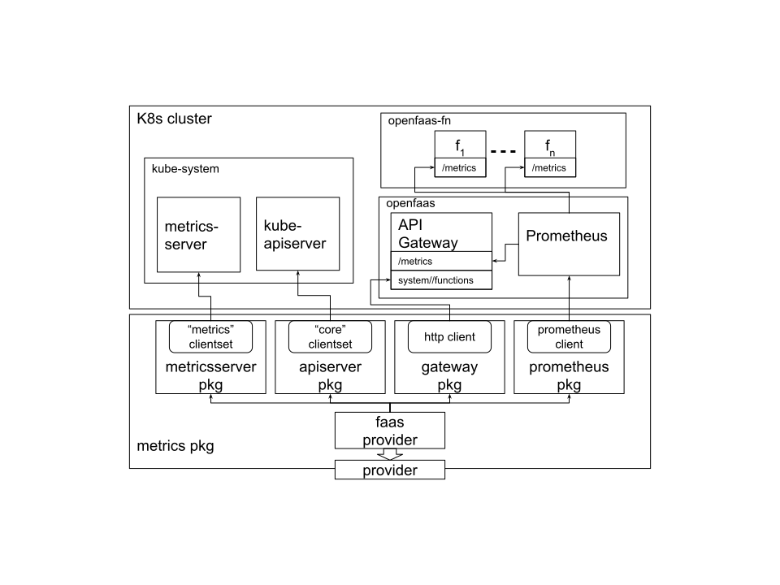

# faas-monitor

faas-monitor application periodically retrieve OpenFaaS functions metrics (such as response time, throughput, CPU
utilization and more) and publish them to NATS included by default in OpenFaaS.


## Available metrics

* Function number of replicas
* Function invocation rate
* Function average response time
* Function average processing time
* Function average cold start time
* Function throughput
* Function nodes
* Per replica CPU utilization
* Per replica memory utilization


## Architecture

faas-monitor makes use of available API of Prometheus, Kubernetes Metrics Server and API Server, and OpenFaaS gateway in
order to get the most relevant functions' metrics.




## Getting Started

### Prerequisites

Before trying out this project make sure you have installed OpenFaaS on your kubernetes cluster.

Deploy your functions with the `prometheus.io.scrape=true` `prometheus.io.port=8081` annotations if you are interested
in the processing time metric.

### Deployment

Edit [deployment](kubernetes/deployment.yml) file in order to match components hostnames and set your preferred scrape
period.

```yml
        ...

        env:
            - name: SCRAPE_PERIOD
              value: "60"
            - name: PROMETHEUS_URL
              value: "http://prometheus.openfaas:9090"
            - name: GATEWAY_URL
              value: "http://gateway.openfaas:8080"
            - name: NATS_URL
              value: "http://nats.openfaas:4222"
            - name: NATS_SUBJECT
              value: "metrics"

```

Deploy the application in a kubernetes cluster as follows:
```bash
$ make install
```
